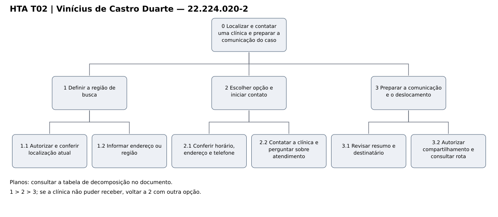
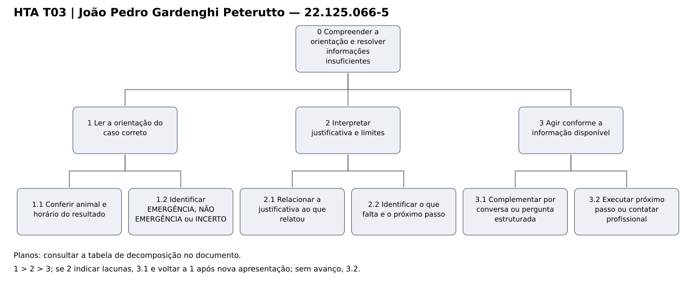
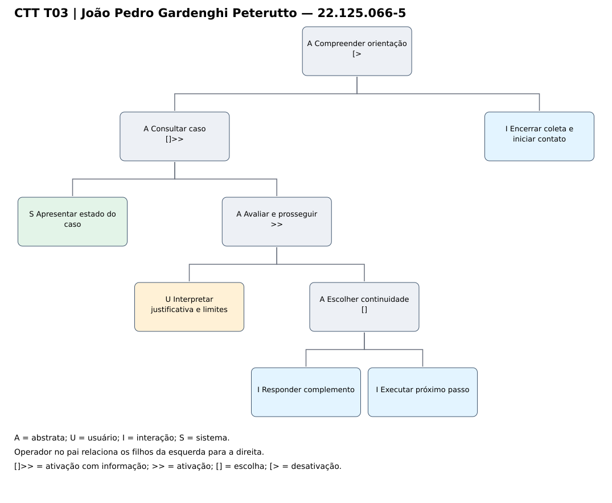
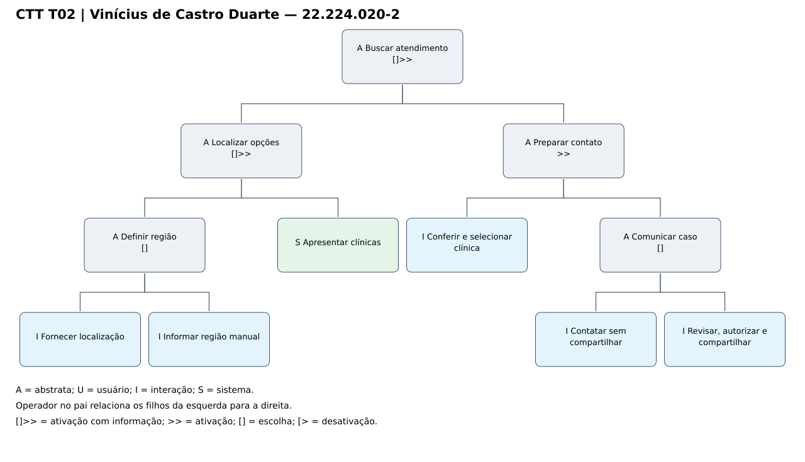

# Entrega 5 — Análise de tarefas: HTA, GOMS e CTT

**Data:** 03/10/2026  
**Status:** 🟨 em andamento  
**Responsabilidade:** cada integrante modela pelo menos 1 HTA, 1 GOMS e 1 CTT. As três técnicas podem abordar a mesma funcionalidade ou funcionalidades distintas, conforme a orientação da disciplina.

## Objetivo da atividade

Modelar tarefas importantes sob perspectivas complementares: decomposição hierárquica (HTA), estrutura de metas/métodos/operações (GOMS) e relações temporais entre tarefas (CTT). O diagrama deve ser acompanhado de interpretação textual.

## Para projetos cujo TCC não previa interface

Modele **tarefas humanas relacionadas ao uso da contribuição técnica**, e não a implementação interna do algoritmo. Exemplos de boas tarefas para análise:

- investigar uma consulta de baixo desempenho;
- configurar uma análise e selecionar parâmetros;
- submeter um dataset e verificar sua validade;
- acompanhar uma execução demorada;
- comparar dois resultados/modelos;
- interpretar uma recomendação e decidir se a aceita;
- localizar uma execução anterior usando busca/filtros;
- gerar e compartilhar um relatório;
- administrar papéis/permissões quando isso for parte do trabalho real;
- revisar um alerta e registrar uma decisão.

Um CRUD pode gerar tarefas relevantes, mas “cadastrar usuário” só merece modelagem se tiver significado no domínio (papéis, validações, riscos, permissões, dependências).

## Seleção das tarefas

| ID | Tarefa | Persona/cenário de origem | Frequência/criticidade | Autor responsável |
|---|---|---|---|---|
| T01 | Relatar sinais e fornecer informações úteis à pré-triagem | P01/C01; R01 e R02; H06, H08, H09 e H12 | A cada pré-triagem; alta criticidade pela fidelidade do relato. | Julian Ryu Takeda — 22.224.030-1 |
| T02 | Localizar e contatar uma clínica e preparar a comunicação do caso | P01/C01 e continuidade de C02/P03; R04 e R05; H03, H05 e H10 | Quando há busca de atendimento; alta criticidade pelo risco de encaminhamento sem confirmação. | Vinícius de Castro Duarte — 22.224.020-2 |
| T03 | Compreender a orientação e resolver informações insuficientes | P02/C03; R01 e R03; H02, H06, H11 e H12 | A cada orientação ou complemento; alta criticidade pela interpretação da incerteza. | João Pedro Gardenghi Peterutto — 22.125.066-5 |

> Priorize tarefas necessárias para que o usuário alcance objetivos centrais. Não desperdice a modelagem em ações triviais isoladas, como “clicar em login”, se o objetivo relevante é maior. Da mesma forma, não modele o funcionamento interno do algoritmo como se fosse uma tarefa humana.

Nesta versão, os modelos preenchidos são de Vinícius e João Peterutto; os campos individuais de Julian permanecem a preencher. Os textos gerais e a síntese da equipe já estão redigidos. Os itens assinalados no checklist foram verificados nos artefatos presentes; a produção de todos os integrantes ainda está pendente. As três técnicas de cada integrante modelam a mesma T01, T02 ou T03. Os modelos são propostas de interação derivadas das Entregas 1 a 4, ainda sujeitas à validação das hipóteses. A interface já integra o TCC; a seção pedagógica sobre TCC sem interface foi preservada como enunciado.

---

## HTA — T01 Relatar sinais e fornecer informações úteis à pré-triagem

**Autor(a):** Julian Ryu Takeda — 22.224.030-1

### Descrição da tarefa

{{objetivo, ponto de início, conclusão esperada, contexto}}

### Diagrama

{{diagrama a preencher pelo integrante responsável}}

### Decomposição e planos

| ID | Objetivo/operação | Plano/ordem | Problema ou decisão de design observada |
|---|---|---|---|
| 0 | {{objetivo principal}} | {{1 }} 2 > 3 / 1 ou 2 etc.> | {{...}} |

**Verificação do HTA:**

- O objetivo 0 representa uma meta do usuário?
- As subtarefas são necessárias e suficientes?
- Os **planos** indicam ordem, alternativa, repetição ou condição?
- A decomposição parou em nível útil para projeto de interação?

---

## HTA — T02 Localizar e contatar uma clínica e preparar a comunicação do caso

**Autor(a):** Vinícius de Castro Duarte — 22.224.020-2

### Descrição da tarefa

Após decidir buscar atendimento, a tutora precisa encontrar uma clínica, conferir informações e iniciar contato. A tarefa começa com a necessidade de atendimento e termina com o contato iniciado e o resumo revisado compartilhado, se autorizado, ou com uma alternativa definida diante de indisponibilidade. C01 fundamenta a busca; C02 fundamenta a prevenção de perda de contexto no contato. P03 é destinatária secundária, não usuária de um dashboard incluído nesta entrega. Não há indicação de especialidade nem garantia automática de vaga.

### Diagrama

Figura HTA T02: elaboração para esta entrega. [Fonte editável](../assets/05_tarefas/hta_t02.json).

### Decomposição e planos

| ID | Objetivo/operação | Plano/ordem | Problema ou decisão de design observada |
|---|---|---|---|
| 0 | Localizar e contatar uma clínica e preparar a comunicação do caso | 1 > 2 > 3; se a clínica não puder receber, voltar a 2 com outra opção. | Compartilhar resumo não significa obter vaga. |
| 1 | Definir a região de busca | Escolher 1.1 ou 1.2. | Não bloquear a busca por recusa de localização. |
| 1.1 | Autorizar e conferir localização atual | Alternativa automática. | Pedir permissão no momento da busca. |
| 1.2 | Informar endereço ou região | Alternativa manual; usar se a localização falhar. | Confirmar região interpretada. |
| 2 | Escolher opção e iniciar contato | 2.1 > 2.2; repetir com outra clínica se não houver resposta ou capacidade. | Distância isolada não comprova adequação. |
| 2.1 | Conferir horário, endereço e telefone | Operação; dados ausentes ficam explícitos. | Exibir origem/atualidade disponível, sem presumir funcionamento. |
| 2.2 | Contatar a clínica e perguntar sobre atendimento | Operação; decisão humana baseada no retorno. | Confirmação depende da unidade, não do sistema. |
| 3 | Preparar a comunicação e o deslocamento | 3.1 > 3.2; compartilhar somente se autorizado; abrir rota quando decidir deslocar-se. | Separar consentimento, entrega da mensagem e confirmação clínica. |
| 3.1 | Revisar resumo e destinatário | Operação; corrigir antes de enviar. | Distinguir relato e interpretação automática. |
| 3.2 | Autorizar compartilhamento e consultar rota | Operações condicionais; pode recusar envio e prosseguir com contato. | Não obrigar compartilhamento para localizar atendimento. |

O diagrama representa a hierarquia de objetivos; a tabela determina a execução. `>` indica sequência; as condições escritas indicam escolhas e retornos. Os nós inferiores representam ações humanas em nível útil para projetar a interação, sem decompor o algoritmo ou cada gesto motor.

**Verificação do HTA:**

- O objetivo 0 representa uma meta do usuário?
- As subtarefas são necessárias e suficientes?
- Os **planos** indicam ordem, alternativa, repetição ou condição?
- A decomposição parou em nível útil para projeto de interação?

Verificação: o objetivo 0 é uma meta do usuário; as operações cobrem o início e a conclusão delimitados; os planos explicitam ordem, alternativas e condições; a decomposição termina em ações observáveis. As exceções de falha e decisão de buscar contato não ficam escondidas na sequência principal.

---

## HTA — T03 Compreender a orientação e resolver informações insuficientes

**Autor(a):** João Pedro Gardenghi Peterutto — 22.125.066-5

### Descrição da tarefa

Roberto precisa compreender a orientação sobre Nina e saber o que fazer. A tarefa começa com a apresentação de um resultado ou de uma solicitação de complemento e termina quando ele identifica a classificação, os limites e o próximo passo, ou busca contato profissional quando a informação permanece insuficiente. O contexto envolve sinais graduais, dados dispersos e pouca familiaridade com aplicações de saúde, sem presumir dificuldades pela idade.

### Diagrama

Figura HTA T03: elaboração para esta entrega. [Fonte editável](../assets/05_tarefas/hta_t03.json).

### Decomposição e planos

| ID | Objetivo/operação | Plano/ordem | Problema ou decisão de design observada |
|---|---|---|---|
| 0 | Compreender a orientação e resolver informações insuficientes | 1 > 2 > 3; se 2 indicar lacunas, 3.1 e voltar a 1 após nova apresentação; sem avanço, 3.2. | INCERTO não equivale a NÃO EMERGÊNCIA. |
| 1 | Ler a orientação do caso correto | 1.1 > 1.2. | Evitar interpretar resultado de outro animal. |
| 1.1 | Conferir animal e horário do resultado | Operação. | Identificar contexto e atualidade. |
| 1.2 | Identificar EMERGÊNCIA, NÃO EMERGÊNCIA ou INCERTO | Operação. | Usar texto e hierarquia, além da cor. |
| 2 | Interpretar justificativa e limites | 2.1 > 2.2. | Não apresentar diagnóstico nem garantia de ausência de risco. |
| 2.1 | Relacionar a justificativa ao que relatou | Operação; pedir explicação se houver dúvida. | Distinguir dado do tutor e inferência. |
| 2.2 | Identificar o que falta e o próximo passo | Operação. | Uma ação principal por estado. |
| 3 | Agir conforme a informação disponível | Escolher 3.1 se INCERTO e houver condição de continuar; escolher 3.2 se houver orientação acionável ou necessidade de contato. | Contato profissional deve permanecer acessível durante a coleta. |
| 3.1 | Complementar por conversa ou pergunta estruturada | Repetir apenas com avanço útil; poder responder não sei; revisar e aguardar atualização. | Formulário direto quando o diálogo não produz informação útil. |
| 3.2 | Executar próximo passo ou contatar profissional | Operação; localizar atendimento quando necessário. | NÃO EMERGÊNCIA não autoriza afirmar que o animal está saudável. |

O diagrama representa a hierarquia de objetivos; a tabela determina a execução. `>` indica sequência; as condições escritas indicam escolhas e retornos. Os nós inferiores representam ações humanas em nível útil para projetar a interação, sem decompor o algoritmo ou cada gesto motor.

**Verificação do HTA:**

- O objetivo 0 representa uma meta do usuário?
- As subtarefas são necessárias e suficientes?
- Os **planos** indicam ordem, alternativa, repetição ou condição?
- A decomposição parou em nível útil para projeto de interação?

Verificação: o objetivo 0 é uma meta do usuário; as operações cobrem o início e a conclusão delimitados; os planos explicitam ordem, alternativas e condições; a decomposição termina em ações observáveis. As exceções de falha e decisão de buscar contato não ficam escondidas na sequência principal.

---

## GOMS — T02 Localizar e contatar uma clínica e preparar a comunicação do caso

**Autor(a):** Vinícius de Castro Duarte — 22.224.020-2

### Goal

`G0: Localizar uma clínica e iniciar contato com informações conferidas`

### Métodos, operadores e regras de seleção

- **Method M1:** Busca pela localização atual: solicitar localização; autorizar; conferir a região; examinar opções; selecionar clínica; conferir horário/endereço/telefone; iniciar contato; comunicar o caso.
  - Operators: Ler solicitação; decidir sobre permissão; tocar autorizar; conferir região; ler opções; comparar dados; tocar clínica; ler informações; tocar contato; relatar o caso.
- **Method M2:** Busca por região manual: informar endereço ou região; revisar; solicitar busca; examinar opções; selecionar clínica; conferir horário/endereço/telefone; iniciar contato; comunicar o caso.
  - Operators: Tocar campo; digitar região; ler e corrigir; tocar buscar; ler opções; comparar dados; tocar clínica; ler informações; tocar contato; relatar o caso.
- **Selection Rule SR1:** usar M1 quando autorizar localização e ela representar o ponto de partida desejado; usar M2 quando não autorizar, a localização falhar ou quiser buscar outra região. Os métodos alcançam a mesma meta; a confirmação de atendimento ocorre pelo contato com a unidade.

> Não chame qualquer passo de “método”. Em GOMS, métodos são sequências alternativas capazes de atingir uma meta; regras de seleção explicam quando escolher entre eles.

Interpretação: M1 e M2 são sequências completas alternativas para G0. Ler/perceber são operadores perceptivos; recordar/decidir são cognitivos; tocar/digitar/falar são ações motoras ou de comunicação. Resposta do sistema é uma condição de continuidade, não uma decisão atribuída ao tutor. Foi adotado GOMS qualitativo, sem estimativas KLM de tempo. O modelo descreve execução conhecida da tarefa; recuperação de falhas e estados de incerteza são detalhados no HTA e no CTT.

---

## GOMS — T01 Relatar sinais e fornecer informações úteis à pré-triagem

**Autor(a):** Julian Ryu Takeda — 22.224.030-1

### Goal

`G0: {{meta do usuário}}`

### Métodos, operadores e regras de seleção

- **Method M1:** {{...}}
  - Operators: {{perceber, apontar, clicar, digitar, decidir... conforme o nível adotado}}
- **Method M2:** {{...}}
  - Operators: {{...}}
- **Selection Rule SR1:** usar M1 quando {{condição}}; usar M2 quando {{condição}}.

> Não chame qualquer passo de “método”. Em GOMS, métodos são sequências alternativas capazes de atingir uma meta; regras de seleção explicam quando escolher entre eles.

---

## GOMS — T03 Compreender a orientação e resolver informações insuficientes

**Autor(a):** João Pedro Gardenghi Peterutto — 22.125.066-5

### Goal

`G0: Fornecer um complemento revisado para esclarecer uma orientação INCERTA`

### Métodos, operadores e regras de seleção

- **Method M1:** Complemento pela conversa: ler a pergunta específica; relacioná-la ao que observou; formular resposta; informar desconhecimento se necessário; revisar; enviar; conferir recebimento.
  - Operators: Ler; recordar; decidir o que sabe; tocar campo; digitar; ler e corrigir; tocar enviar; perceber confirmação.
- **Method M2:** Complemento pela pergunta estruturada: ler a pergunta direta e suas opções; relacioná-las ao que observou; escolher a resposta ou não sei; revisar; confirmar; conferir recebimento.
  - Operators: Ler pergunta; ler opções; recordar; decidir; tocar opção; conferir seleção; tocar confirmar; perceber confirmação.
- **Selection Rule SR1:** usar M1 enquanto a conversa permitir informar a lacuna de modo útil; usar M2 quando o sistema apresentar a pergunta estruturada por falta de avanço útil e a lacuna puder ser respondida pelas opções. Ambos fornecem informação sobre a mesma lacuna; responder não sei é válido e não garante uma classificação conclusiva.

> Não chame qualquer passo de “método”. Em GOMS, métodos são sequências alternativas capazes de atingir uma meta; regras de seleção explicam quando escolher entre eles.

Interpretação: M1 e M2 são sequências completas alternativas para G0. Ler/perceber são operadores perceptivos; recordar/decidir são cognitivos; tocar/digitar/falar são ações motoras ou de comunicação. Resposta do sistema é uma condição de continuidade, não uma decisão atribuída ao tutor. Foi adotado GOMS qualitativo, sem estimativas KLM de tempo. O modelo descreve execução conhecida da tarefa; recuperação de falhas e estados de incerteza são detalhados no HTA e no CTT.

G0 é a submeta de complementação de T03. A leitura do resultado e a ação posterior continuam representadas no HTA e no CTT; não foram tratadas como métodos alternativos de fornecer a mesma informação.

---

## CTT — T03 Compreender a orientação e resolver informações insuficientes

**Autor(a):** João Pedro Gardenghi Peterutto — 22.125.066-5

### Descrição

O sistema apresenta o estado do caso e os dados para interpretação pelo tutor. A classificação, justificativa e limites precedem a escolha entre complementar informações e executar o próximo passo. Encerrar a coleta e iniciar contato pode interromper o fluxo. A opção de complemento só fica habilitada quando há uma lacuna; a ação correspondente ao resultado deve ser apresentada quando houver orientação acionável.

### Diagrama

Figura CTT T03: elaboração para esta entrega. [Fonte editável](../assets/05_tarefas/ctt_t03.json).

### Legenda e relações temporais usadas

| Operador/relação | Significado no diagrama | Exemplo no modelo |
|---|---|---|
| `A` | Tarefa abstrata: composição de subtarefas. | Raiz e agrupamentos internos. |
| `I` | Interação entre usuário e sistema. | Preencher, selecionar ou confirmar informações. |
| `[]>>` | Ativação com passagem de informação: a segunda tarefa começa após a primeira e recebe seus dados. | Estado do caso e avaliação pelo tutor. |
| `[]` | Escolha: iniciar uma alternativa desabilita a outra naquele ciclo. | Complementar ou executar o próximo passo, conforme estado e condição. |
| `>>` | Ativação: a segunda tarefa começa depois da primeira. | Interpretar justificativa antes de escolher continuidade. |
| `[>` | Desativação: a tarefa da direita interrompe a da esquerda; não há retomada automática. | Encerrar a coleta e iniciar contato profissional. |
| `S` | Tarefa de sistema. | Apresentar estado do caso. |
| `U` | Tarefa do usuário fora do diálogo com o sistema. | Interpretar mentalmente justificativa e limites. |

Os operadores escritos no nó abstrato relacionam seus filhos da esquerda para a direita. A árvore representa decomposição temporal, não navegação entre telas. Tipos de tarefa estão identificados pelas letras, além das cores. `[]>>`, `>>`, `[]` e `[>` seguem as relações apresentadas nos slides de GOMS-CTT, páginas 19 a 23.

Identifique, quando aplicável, tarefas de usuário, sistema, interação e tarefas abstratas. Verifique se concorrência, escolha, habilitação, desabilitação e repetição estão representadas corretamente segundo a notação adotada em aula.

Se o complemento for enviado, um novo ciclo começa com a apresentação atualizada do estado do caso. Esse retorno condicional é descrito no HTA; o CTT mostra um ciclo. Não há repetição obrigatória ou indefinida. A consulta de uma ajuda que preserve o ponto de leitura seria suspensão/retomada (`|>`), mas esse recurso não foi incluído no diagrama.

---

## CTT — T01 Relatar sinais e fornecer informações úteis à pré-triagem

**Autor(a):** Julian Ryu Takeda — 22.224.030-1

### Descrição

{{...}}

### Diagrama

{{diagrama a preencher pelo integrante responsável}}

### Legenda e relações temporais usadas

| Operador/relação | Significado no diagrama | Exemplo no modelo |
|---|---|---|
| {{...}} | {{...}} | {{...}} |

Identifique, quando aplicável, tarefas de usuário, sistema, interação e tarefas abstratas. Verifique se concorrência, escolha, habilitação, desabilitação e repetição estão representadas corretamente segundo a notação adotada em aula.

---

## CTT — T02 Localizar e contatar uma clínica e preparar a comunicação do caso

**Autor(a):** Vinícius de Castro Duarte — 22.224.020-2

### Descrição

A região é definida por localização atual ou entrada manual. O sistema usa essa informação para apresentar clínicas. O tutor examina os dados e seleciona uma opção antes de preparar o contato. Pode comunicar o caso sem compartilhar um resumo ou revisar, autorizar e compartilhar. A escolha não transforma envio em confirmação de atendimento.

### Diagrama

Figura CTT T02: elaboração para esta entrega. [Fonte editável](../assets/05_tarefas/ctt_t02.json).

### Legenda e relações temporais usadas

| Operador/relação | Significado no diagrama | Exemplo no modelo |
|---|---|---|
| `A` | Tarefa abstrata: composição de subtarefas. | Raiz e agrupamentos internos. |
| `I` | Interação entre usuário e sistema. | Preencher, selecionar ou confirmar informações. |
| `[]>>` | Ativação com passagem de informação: a segunda tarefa começa após a primeira e recebe seus dados. | Região e apresentação das clínicas; opções e preparação do contato. |
| `[]` | Escolha: iniciar uma alternativa desabilita a outra naquele ciclo. | Localização ou região manual; compartilhar ou contatar sem resumo. |
| `>>` | Ativação: a segunda tarefa começa depois da primeira. | Selecionar clínica antes de comunicar o caso. |
| `S` | Tarefa de sistema sem diálogo durante seu processamento. | Apresentar opções com base na região informada. |

Os operadores escritos no nó abstrato relacionam seus filhos da esquerda para a direita. A árvore representa decomposição temporal, não navegação entre telas. Tipos de tarefa estão identificados pelas letras, além das cores. `[]>>`, `>>`, `[]` e `[>` seguem as relações apresentadas nos slides de GOMS-CTT, páginas 19 a 23.

Identifique, quando aplicável, tarefas de usuário, sistema, interação e tarefas abstratas. Verifique se concorrência, escolha, habilitação, desabilitação e repetição estão representadas corretamente segundo a notação adotada em aula.

Um contato sem resposta ou uma clínica indisponível exige um novo ciclo de escolha de opção, conforme o HTA. Não foi modelado atendimento simultâneo, pois selecionar e verificar a clínica antecedem a comunicação neste recorte.

---

## Síntese da equipe

Quais problemas de interação, oportunidades e requisitos apareceram a partir das modelagens? Quais tarefas irão para o protótipo e para o teste de usabilidade?

T01 evidencia o risco de perder ou distorcer o relato, especialmente por transcrição não revisada, repetição de perguntas e falha no envio. T02 evidencia a diferença entre encontrar uma clínica, iniciar contato, compartilhar informações e obter confirmação de atendimento. T03 evidencia que ler uma classificação não garante compreender os motivos, os limites ou o próximo passo. Essas interpretações são resultados da modelagem, não resultados de testes já realizados.

O protótipo deve permitir revisão e correção sem perda de contexto, alternativa manual à localização, pergunta estruturada quando a conversa não avançar e identificação explícita do estado do caso. A lógica de coleta vigente usa cinco sintomas da base para a classificação: com informação insuficiente, INCERTO conduz à complementação. Cinco mensagens ou cinco detalhes administrativos não equivalem a cinco sintomas. O tutor não deve inventar um sinal para completar a coleta. O limiar de detecção de conversa improdutiva ainda precisa ser definido e avaliado; a modelagem não estabelece uma quantidade arbitrária de tentativas. O contato profissional continua disponível durante a coleta.

A classificação utiliza EMERGÊNCIA, NÃO EMERGÊNCIA e INCERTO. INCERTO significa insuficiência para concluir; NÃO EMERGÊNCIA não representa diagnóstico nem garantia de saúde. O encaminhamento usa endereço, horário e telefone disponíveis, sem indicação de especialidade. A comunicação do resumo depende de revisão e autorização; recebimento da mensagem e capacidade de atendimento são estados distintos. H03, H05 e H09 permanecem abertas; não se afirma validação da interface clínica, da utilidade do resumo ou da preferência por voz.

| Tarefa | Cobertura no protótipo | Situação no teste de usabilidade | Evidência a observar |
|---|---|---|---|
| T01 | Relato por texto; alternativa de voz e revisão quando disponível; complementação; envio e falha | Informar um caso fornecido pelo avaliador e corrigir uma transcrição com erro | Fidelidade do relato, correção percebida, conclusão, tempo, erros e perda de dados |
| T02 | Busca automática/manual; dados da clínica; contato; resumo revisável e consentimento | Buscar atendimento com localização recusada e escolher outra clínica após indisponibilidade | Se encontra a alternativa, confere informações e distingue contato/envio de confirmação |
| T03 | Resultado, justificativa, limites, INCERTO e pergunta estruturada | Explicar o resultado com suas palavras e responder a uma lacuna sem inventar informação | Compreensão da classificação e do próximo passo; uso de não sei; perguntas repetidas e abandono |

Os testes são simulações com casos fictícios e avaliam a interação, não a precisão clínica. A alternativa de voz e o compartilhamento podem ser prototipados para investigar as hipóteses sem transformar sua implementação em fato. O núcleo prioritário é o fluxo do tutor; não foram adicionados login, dashboard, CRUD administrativo ou filtros sem objetivo de domínio.

| Necessidade na matriz | Persona/cenário | Tarefa e artefatos desta entrega |
|---|---|---|
| R01 | P01/C01 e P02/C03 | T01 e T03; respectivos HTA, GOMS e CTT |
| R02 | P01/C01 | T01; HTA-T01, GOMS-T01 e CTT-T01 |
| R03 | P02/C03 | T03; HTA-T03, GOMS-T03 e CTT-T03 |
| R04 | P01/C01 | T02; HTA-T02, GOMS-T02 e CTT-T02 |
| R05 | Continuidade de C02; P01 como emissora e P03 como destinatária | T02; HTA-T02, GOMS-T02 e CTT-T02; hipótese secundária H03/H05 |

A tabela liga os modelos às necessidades existentes. As substituições necessárias em RASTREABILIDADE.md estão no arquivo complementar `ajustes_rastreabilidade.md`; sua aplicação no repositório não foi realizada nesta entrega. Por isso, o item específico da matriz permanece desmarcado no checklist até essa integração.

Base utilizada: guias de uso e escopo, README, matriz e Entregas 1 a 4 do repositório Ryu2525/INTERFACE-HUMANO-COMPUTADOR, consultados em 03/10/2026, revisão 281ba8adfb7734dafd92d090f50dbef1d935b35e. Referência conceitual principal: slides CC8122-HTA, páginas 2 a 10, e CC8122-GOMS-CTT, páginas 2 a 23, material da disciplina baseado em Barbosa e Silva (2010). Os slides de personas, cenários, refinamento, qualidade de uso e abordagens teóricas fundamentam a continuidade entre contexto, tarefa e decisões de interação. As hipóteses de esforço e acessibilidade não foram convertidas em resultados empíricos.

## Checklist

- [ ] Cada integrante produziu ao menos 1 HTA, 1 GOMS e 1 CTT.
- [x] Cada artefato identifica autor e tarefa.
- [x] Diagramas são legíveis e possuem fonte editável quando possível.
- [x] HTA contém planos, não apenas árvore de tópicos.
- [x] GOMS distingue Goals, Operators, Methods e Selection Rules.
- [x] CTT usa operadores temporais e tipos de tarefa coerentes.
- [x] Há texto explicando cada diagrama.
- [ ] Tarefas estão ligadas a cenários/personas na rastreabilidade.
- [x] Em TCC técnico, as tarefas descrevem o que a pessoa faz com a contribuição/resultados, não passos internos do código.
- [x] CRUDs, relatórios, filtros e atividades administrativas foram escolhidos por relevância ao objetivo do usuário.
